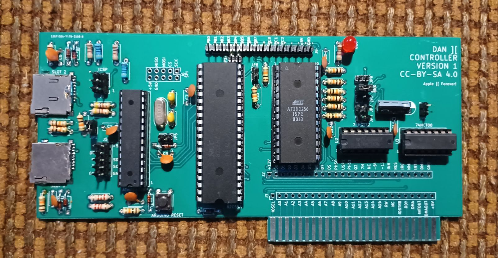

# Apple II Storage Interface and Arduino Inteface

This is a simple card that provides two SD cards as mass storage devices to ProDOS as well as will provide networking using a Wiznet W5500.  A ATMEGA328P programmed using the Arduino development environment is interfaced to the Apple II bus using a 82C55 peripheral interface.  The design uses only five commonly available integrated circuits, the 74HCT08 AND gate, 74HCT32 OR gate, 82C55A peripheral interface, a 28C256 flash memory chip, and a ATMEGA328P microcontroller, and so should be reasonably future-proofed as much as any design for a 40 year old computer can be.

The gerbers for the PCB are in the Apple2Card directly can be made by JLCPCB or PCBway, for example.  The firmware is the "Firmware.bin" file in the Apple2Card directory.  It is a 512 byte file that can be burned onto a 27C128/28C256 flash memory chip using a programmer such as a TL866 plus ii.  Only the first 512 bytes are used of this memory.  The firmware for the ATMEGA328P is the Apple2Arduino sketch in the Apple2Arduino directory.  It should be uploaded using a programmer, however, the bootloader needs to be uploaded first. It should be flashed onto the ATMEGA328P chip without a bootloader.  No SD cards should be present in the SD card slots when the ATMEGA328P is flashed if the ICSP connector on the card is used.  There is a program called FLASH.SYSTEM which can flash the ATMEGA328P on the board.  The jumpers JP2, JP3, JP4, JP6, JP7, JP8, JP9, and JP10 should be closed when flashing with the FLASH.SYSTEM program.  With normal use, all of the jumpers should be open except for JP2 which is closed.

The J1 connector is the ICSP connector for programming the ATMEGA32P.

The J2 and J3 connector break out the bus pins of the Apple II.

The J4 connect are the extra pins of the 82C55 broken out onto a connector.

The J5 connector is for debugging.

The J6 connector is for a Wiznet 5500 SPI ethernet controller (similar to Uthernet).  This has not been implemented yet.

Either micro SD or micro SDHC cards may be used (up to 32 GB capacity), with either FAT16 or FAT32 as the first partition when the FAT filesystem mode is used.  In the raw block mode, only up to the first 512 MB can be used.  To prepare SD cards to be used with storage, you can do it two ways:

The first mode is raw block mode on the SD card.  To use raw block mode, find the "Blankvols.zip" file in the firmware directory.  Unzip this file, and the resulting "Blankvols.PO" file is 512 MB in length.  This can be written to a SD card using an utility such as Win32DiskImager or "dd" under linux.  This is 16 concatenated prepared ProDOS volumes.  Place this in SLOT1 of the card.

The second mode is FAT filesystem mode on the SD card.  A ProDOS order disk image of 32 megabytes can be copied onto the SD card and used.  Such an image is already provided as the file "SingleBlankVol.zip" which is a 32 MB file once unzipped.  Place this file into into the root directory as a file "BLKDEV0X.PO" where X is a digit between 1 and 9.  The default is "1" so for simplicity name it "BLKDEV01.PO".  The ProDOS disk images can be read/written by software such as CiderPress ( https://a2ciderpress.com/ ) so that you can use this to transfer files to and from the Apple II.  Files can be copied onto the ProDOS disk image partition which can then be read/written by CiderPress and transferred to other media.

To make a volume bootable, copy the "PRODOS.SYSTEM" and other system files to be started on booting, for example "BASIC.SYSTEM".

The card can work from any slot, but slot 7 is a good choice so that it can be booted from.  When the card is booted the message "DAN II PRESS RTN" appears on the bottom of the screen.  If the return key is not pressed for a second, then normal booting continues.  The default configuration is to boot the card in SLOT 1 in raw block mode and SLOT 2 in FAT filesystem mode with the filename as "BLKDEV01.PO".

If the return key is pressed during boot up, the following message is shown:

"CARD 1 (0-9,!):"

If in response to this the digit 0 is pressed, the raw block mode is used for SLOT 1.  If digits 1-9 are pressed, FAT filesystem mode is used for SLOT 1, with the filename being "BLKDEV0X.PO" with X being the key pressed.  If ! is pressed, then the mode is wide block mode where both drive 1 and drive 2 of ProDOS are directed to SLOT 1.

Then the next message appears

"CARD 2 (0-9):"

If in response to this the digit 0 is pressed, the raw block mode is used for SLOT 2.  If digits 1-9 are pressed, FAT filsystem mode is used for SLOT 2, with the filename being "BLKDEV0X.PO" with X being the key pressed.  Note that only one of the two slots can be used with FAT filesystem mode at a given time.  If wide block mode is used for CARD 1, then this option does not matter for SLOT 2.

After setting the modes of the two slots, the system continues booting.

Ordinarily, only a maximum of 64 MB is addressable, 32 MB for ProDOS drive 1, and a second 32 MB for ProDOS drive 2.  The program ALLVOLS.SYSTEM allows this limit to be circumvented in ProDOS 8.  For a SD card placed in slot 1, write the image in "BlankVols" or "BlankVolsSlot1"to it, and for a SD card in slot 2, write the image file "BlankVolsSlot2" to it.  When ALLVOLS.SYSTEM is executed, extra volumes may be added from slot 1 or slot 2 depending on if a SD card with block images is present in slot 1 or slot 2.  It is recommended that slot 1 be used for block images and slot 2 be used for FAT FS images.  This way, cards can be swapped in and out of slot 2 with different files transferred from another computer (perhaps using CiderPress) while the boot filesystem in slot 1 stays the same.

