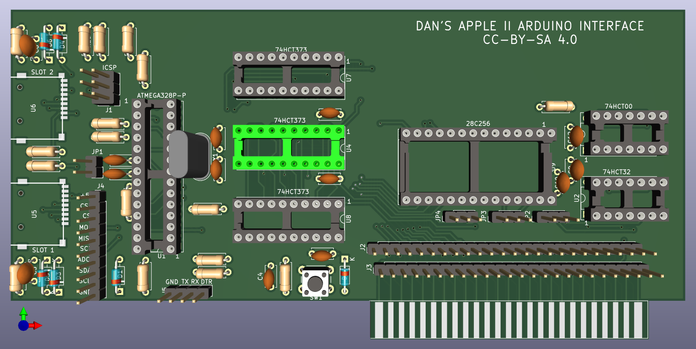

# Apple II Storage Interface and Arduino Inteface

This is a simple card to interface an ATMEGA328P to an Apple II bus that will be turned into a mass storage device with an SD card, or some other purposes.

